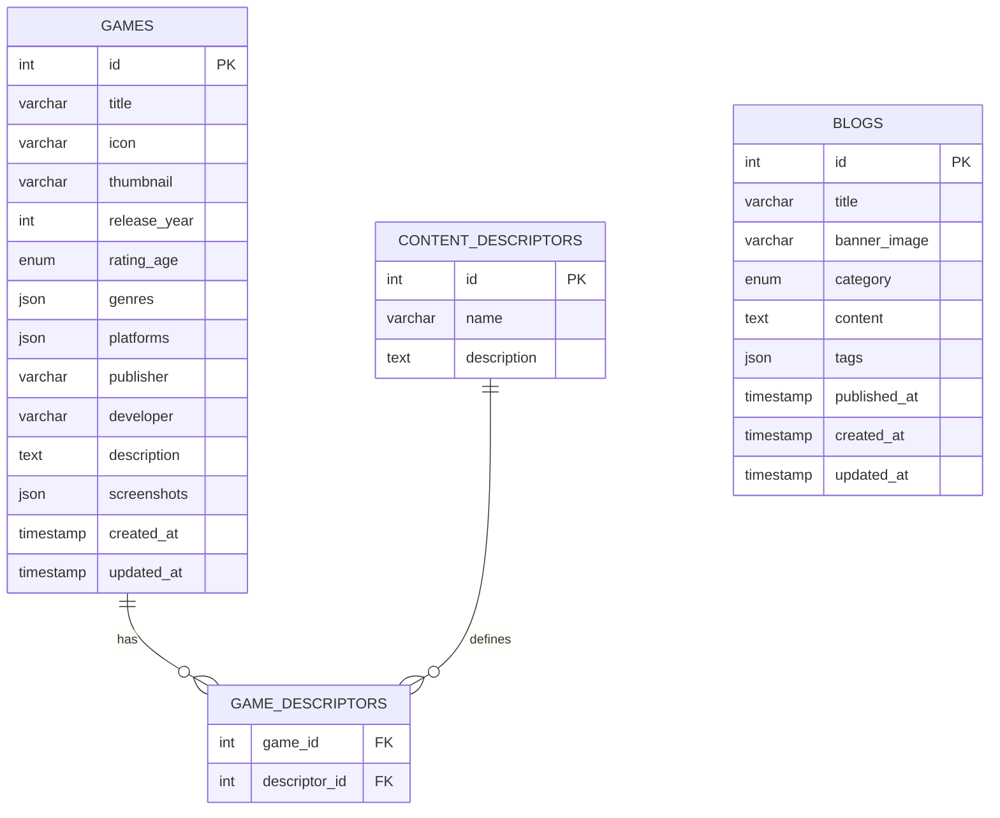

# Dokumentasi Backend API & Basis Data IGRS (Indonesia Game Rating System)

Dokumentasi ini dibuat sebagai referensi pengembangan sisi Backend untuk mendukung portal **IGRS**. Dokumentasi ini mencakup skema basis data relasional yang telah dinormalisasi serta spesifikasi API untuk dua entitas utama: **Gim (Games)** dan **Blog/Artikel/Pengumuman (Blogs)**.

---

## 1. Skema Basis Data (Database Schema)

Skema database dirancang menggunakan pendekatan relasional untuk mendukung klasifikasi gim secara fleksibel melalui normalisasi data *content descriptors*.



### A. Tabel `games`
Menyimpan metadata dasar dari gim yang terdaftar di sistem IGRS.

| Kolom | Tipe Data | Atribut | Deskripsi |
| :--- | :--- | :--- | :--- |
| `id` | `INT` | PK, Auto Increment | ID unik gim. |
| `title` | `VARCHAR(255)` | Not Null | Judul gim (misal: *Mobile Legends: Bang Bang*). |
| `icon` | `VARCHAR(255)` | Not Null | URL gambar ikon gim (biasanya bentuk persegi 1:1). |
| `thumbnail` | `VARCHAR(255)` | Not Null | URL gambar thumbnail/banner gim (biasanya bentuk lanskap). |
| `release_year` | `INT` | Not Null | Tahun rilis resmi gim (misal: `2016`). |
| `rating_age` | `ENUM` | Not Null | Klasifikasi rating usia: `'3+'`, `'7+'`, `'13+'`, `'15+'`, `'18+'`. |
| `genres` | `JSON` | Not Null | Array string genre gim (misal: `["MOBA", "Strategy", "Action"]`). |
| `platforms` | `JSON` | Not Null | Platform yang tersedia (misal: `["Android", "iOS"]`). |
| `publisher` | `VARCHAR(100)` | Not Null | Nama perusahaan penerbit gim. |
| `developer` | `VARCHAR(100)` | Not Null | Nama pengembang gim. |
| `description` | `TEXT` | Not Null | Deskripsi lengkap mengenai alur dan fitur gim. |
| `screenshots` | `JSON` | Default `[]` | Array URL gambar tangkapan layar (screenshot) gim. |
| `created_at` | `TIMESTAMP` | Default `NOW()` | Tanggal data ditambahkan. |
| `updated_at` | `TIMESTAMP` | Default `NOW()` | Tanggal terakhir data diperbarui. |

### B. Tabel `content_descriptors` (Normalisasi)
Tabel master untuk deskripsi klasifikasi konten sensitif dalam gim berdasarkan standar IGRS.

| Kolom | Tipe Data | Atribut | Deskripsi |
| :--- | :--- | :--- | :--- |
| `id` | `INT` | PK, Auto Increment | ID unik deskriptor konten. |
| `name` | `VARCHAR(100)` | Not Null, Unique | Nama indikator konten (misal: *Violence*, *Drugs*, *Gambling*). |
| `description` | `TEXT` | Not Null | Penjelasan maksud dari indikator tersebut. |

> [!NOTE]
> **Daftar Master Deskriptor Konten IGRS:**
> 1. **Violence** - Menampilkan aksi pertarungan atau kekerasan.
> 2. **Sexuality** - Mengandung unsur romantis atau konten dewasa.
> 3. **Drugs** - Menampilkan atau merujuk pada penggunaan narkoba.
> 4. **Gambling** - Mengandung unsur taruhan atau perjudian.
> 5. **Language** - Mengandung kata-kata kasar atau tidak pantas.
> 6. **Blood** - Menampilkan darah atau luka.
> 7. **Horor** - Mengandung adegan menyeramkan atau menegangkan.
> 8. **Online Interactions** - Pemain dapat berinteraksi dengan orang lain secara online.
> 9. **Character Appearance** - Mengandung kostum atau penampilan karakter tertentu.

### C. Tabel `game_descriptors` (Junction Table)
Menghubungkan entitas gim dengan deskriptor konten yang ada di dalamnya (Relasi *Many-to-Many*).

| Kolom | Tipe Data | Atribut | Deskripsi |
| :--- | :--- | :--- | :--- |
| `game_id` | `INT` | FK, Composite PK | Merujuk ke `games.id` (Cascade on Delete). |
| `descriptor_id` | `INT` | FK, Composite PK | Merujuk ke `content_descriptors.id` (Cascade on Delete). |

### D. Tabel `blogs`
Menyimpan data berita, artikel edukasi, serta pengumuman penting IGRS.

| Kolom | Tipe Data | Atribut | Deskripsi |
| :--- | :--- | :--- | :--- |
| `id` | `INT` | PK, Auto Increment | ID unik artikel/pengumuman. |
| `title` | `VARCHAR(255)` | Not Null | Judul artikel (misal: *Panduan Cuplikan Konten*). |
| `banner_image` | `VARCHAR(255)` | Not Null | URL gambar utama/banner artikel. |
| `category` | `ENUM` | Not Null | Kategori tulisan: `'Pengumuman Penting'`, `'Berita'`. |
| `content` | `TEXT` | Not Null | Konten utama artikel (mendukung format Markdown/HTML). |
| `tags` | `JSON` | Not Null | Kumpulan tag artikel (misal: `["IGRS", "Edukasi", "Sosialisasi"]`). |
| `published_at` | `TIMESTAMP` | Not Null | Waktu publikasi artikel ke publik. |
| `created_at` | `TIMESTAMP` | Default `NOW()` | Tanggal data ditambahkan. |
| `updated_at` | `TIMESTAMP` | Default `NOW()` | Tanggal terakhir data diperbarui. |

---

## 2. Dokumentasi API Endpoints (API Specification)

Semua request dan response menggunakan format **JSON**. Basis URL API didefinisikan sebagai `/api/v1`.

### A. Modul Gim (Games API)

#### 1. Mendapatkan Daftar Gim
* **Endpoint:** `GET /games`
* **Query Parameters (Opsional):**
  * `search` (string) - Mencari gim berdasarkan judul.
  * `rating_age` (string) - Memfilter berdasarkan rating usia (contoh: `18+`, `13+`).
  * `sort` (string) - Mengurutkan hasil (`popular` untuk popularitas pemain, `trending`, `newest` untuk terbaru).
  * `page` (int) - Nomor halaman untuk pagination (default: `1`).
  * `limit` (int) - Jumlah data per halaman (default: `10`).

* **Contoh Response (Success - `200 OK`):**
  ```json
  {
    "status": "success",
    "message": "Daftar gim berhasil diambil",
    "total_items": 45,
    "data": [
      {
        "id": 1,
        "title": "Pulau Petualangan Fantasi",
        "icon": "https://api.igrs.id/uploads/games/pulau-petualangan-icon.jpg",
        "release_year": 2024,
        "rating_age": "3+",
        "genres": ["Petualangan", "Puzzle"],
        "content_descriptors": [
          {
            "id": 8,
            "name": "Online Interactions"
          }
        ]
      },
      {
        "id": 2,
        "title": "Neon Drift Racing",
        "icon": "https://api.igrs.id/uploads/games/neon-drift-icon.jpg",
        "release_year": 2023,
        "rating_age": "7+",
        "genres": ["Balapan", "Multiplayer"],
        "content_descriptors": [
          {
            "id": 8,
            "name": "Online Interactions"
          }
        ]
      },
      {
        "id": 3,
        "title": "Legenda Kota Hilang",
        "icon": "https://api.igrs.id/uploads/games/legenda-kota-icon.jpg",
        "release_year": 2025,
        "rating_age": "13+",
        "genres": ["Aksi", "RPG"],
        "content_descriptors": [
          {
            "id": 1,
            "name": "Violence"
          },
          {
            "id": 5,
            "name": "Language"
          }
        ]
      }
    ]
  }
  ```

#### 2. Mendapatkan Detail Gim Berdasarkan ID
* **Endpoint:** `GET /games/:id`
* **Contoh Response (Success - `200 OK`):**
  ```json
  {
    "status": "success",
    "message": "Detail gim berhasil ditemukan",
    "data": {
      "id": 4,
      "title": "Mobile Legends: Bang Bang",
      "icon": "https://api.igrs.id/uploads/games/mlbb-icon.jpg",
      "thumbnail": "https://api.igrs.id/uploads/games/mlbb-thumbnail.jpg",
      "release_year": 2016,
      "rating_age": "18+",
      "genres": ["Aksi", "MOBA", "Strategi"],
      "platforms": ["Android", "iOS"],
      "publisher": "Moonton Games",
      "developer": "Moonton",
      "description": "Mobile Legends: Bang Bang adalah salah satu permainan Arena Pertarungan Daring Multipemain (MOBA) seluler paling populer di dunia yang menyatukan komunitas melalui kerja sama tim dan strategi.",
      "screenshots": [
        "https://api.igrs.id/uploads/games/mlbb-ss1.jpg",
        "https://api.igrs.id/uploads/games/mlbb-ss2.jpg",
        "https://api.igrs.id/uploads/games/mlbb-ss3.jpg"
      ],
      "content_descriptors": [
        {
          "id": 1,
          "name": "Violence",
          "description": "Menampilkan aksi pertarungan atau kekerasan."
        },
        {
          "id": 8,
          "name": "Online Interactions",
          "description": "Pemain dapat berinteraksi dengan orang lain secara online."
        },
        {
          "id": 9,
          "name": "Character Appearance",
          "description": "Mengandung kostum atau penampilan karakter tertentu."
        }
      ],
      "created_at": "2026-01-10T08:30:00Z",
      "updated_at": "2026-06-20T12:00:00Z"
    }
  }
  ```

#### 3. Mendapatkan Rekap Jumlah Gim Berdasarkan Rating
* **Endpoint:** `GET /games/summary/ratings`
* **Contoh Response (Success - `200 OK`):**
  ```json
  {
    "status": "success",
    "message": "Rekapitulasi jumlah gim berdasarkan rating berhasil diambil",
    "data": [
      { "rating_age": "3+", "total_games": 856 },
      { "rating_age": "7+", "total_games": 1032 },
      { "rating_age": "13+", "total_games": 768 },
      { "rating_age": "15+", "total_games": 534 },
      { "rating_age": "18+", "total_games": 412 }
    ]
  }
  ```

---

### B. Modul Blog / Artikel (Blogs API)

#### 1. Mendapatkan Daftar Blog / Artikel
* **Endpoint:** `GET /blogs`
* **Query Parameters (Opsional):**
  * `category` (string) - Memfilter kategori (`Pengumuman Penting` atau `Berita`).
  * `search` (string) - Mencari berdasarkan kata kunci judul.
  * `limit` (int) - Jumlah data yang diambil (default: `10`).

* **Contoh Response (Success - `200 OK`):**
  ```json
  {
    "status": "success",
    "message": "Daftar artikel berhasil diambil",
    "data": [
      {
        "id": 101,
        "title": "Evaluation and Temporary Suspension of Game Classification Services (IGRS)",
        "banner_image": "https://api.igrs.id/uploads/blogs/igrs-suspension.jpg",
        "category": "Pengumuman Penting",
        "snippet": "The Indonesia Game Rating System (IGRS) is currently undergoing a comprehensive review...",
        "tags": ["IGRS", "Suspension", "Layanan"],
        "published_at": "2020-06-16T00:00:00Z"
      },
      {
        "id": 102,
        "title": "SERVICE STATEMENT",
        "banner_image": "https://api.igrs.id/uploads/blogs/service-statement.jpg",
        "category": "Berita",
        "snippet": "The Ministry of Digital Ecosystem is committed to implementing and improving its services...",
        "tags": ["Berita", "Kominfo", "Pelayanan"],
        "published_at": "2025-10-24T00:00:00Z"
      },
      {
        "id": 103,
        "title": "Tips Memilih Game Edukasi untuk Anak Usia 3-7 Tahun",
        "banner_image": "https://api.igrs.id/uploads/blogs/edu-games.jpg",
        "category": "Berita",
        "snippet": "Memilih game edukasi yang tepat membantu tumbuh kembang anak secara kognitif...",
        "tags": ["Edukasi", "Anak", "Tips"],
        "published_at": "2024-05-10T00:00:00Z"
      }
    ]
  }
  ```

#### 2. Mendapatkan Detail Artikel Berdasarkan ID
* **Endpoint:** `GET /blogs/:id`
* **Contoh Response (Success - `200 OK`):**
  ```json
  {
    "status": "success",
    "message": "Detail artikel berhasil ditemukan",
    "data": {
      "id": 104,
      "title": "Panduan Cuplikan Konten",
      "banner_image": "https://api.igrs.id/uploads/blogs/buku-panduan.jpg",
      "category": "Pengumuman Penting",
      "content": "### Daftar Isi\n\n1. Definisi Cuplikan Konten dan Cuplikan Permainan\n2. Ketentuan Pengisian Cuplikan dalam URL\n3. Contoh Cuplikan Konten dan Cuplikan Permainan\n\n### 1. Definisi\n\n**Cuplikan Konten** adalah kumpulan dokumen visual berupa gambar yang merujuk pada konten kekerasan, darah, horor, penampilan rokok dan/atau narkotika, penggunaan...",
      "tags": ["IGRS", "Klasifikasi", "Panduan"],
      "published_at": "2025-10-01T00:00:00Z",
      "created_at": "2025-10-01T00:00:00Z",
      "updated_at": "2025-10-01T00:00:00Z"
    }
  }
  ```

---

## 3. Penanganan Error (Error Handling)

API menggunakan kode status HTTP standar untuk menunjukkan keberhasilan atau kegagalan request.

| HTTP Status Code | Deskripsi | Skenario Kasus |
| :--- | :--- | :--- |
| `200 OK` | Request Berhasil | Mendapatkan data, memperbarui data, menghapus data. |
| `201 Created` | Resource Baru Terbuat | Berhasil menambahkan gim atau artikel baru. |
| `400 Bad Request` | Validasi Payload Gagal | Ada parameter wajib yang kurang atau format payload salah. |
| `401 Unauthorized` | Autentikasi Diperlukan | Token admin tidak dikirim atau tidak valid pada endpoint terproteksi. |
| `404 Not Found` | Data Tidak Ditemukan | ID gim atau ID artikel yang diminta tidak eksis di database. |
| `500 Internal Server Error` | Gangguan Server | Terjadi kegagalan koneksi database atau error server internal lainnya. |

#### Contoh Payload Error (`404 Not Found`):
```json
{
  "status": "fail",
  "message": "Data gim dengan ID 999 tidak ditemukan"
}
```

#### Contoh Payload Error (`400 Bad Request`):
```json
{
  "status": "fail",
  "message": "Validasi gagal",
  "errors": {
    "title": "Judul gim wajib diisi",
    "rating_age": "Rating usia harus bernilai '3+', '7+', '13+', '15+', atau '18+'"
  }
}
```
